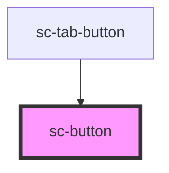

# sc-button


<!-- Auto Generated Below -->


## Usage

### Button

```html
<!-- Default -->
<sc-button onclick="alert('yo')">Alert</sc-button>

<!-- Anchor -->
<sc-button href="/" target="_blank" rel="noreferrer" title="button"
  >Anchor
</sc-button>

<!-- Block level -->
<sc-button block>Block Button</sc-button>

<!-- Icon -->
<sc-button icon>
  <i class="la la-home"></i>
</sc-button>

<!-- Bordered -->
<sc-button bordered>
  <i class="la la-back"></i> Bordered button
</sc-button>

```


## Properties

| Property   | Attribute  | Description                                                                                                                                                                                                                                                                               | Type                              | Default     |
| ---------- | ---------- | ----------------------------------------------------------------------------------------------------------------------------------------------------------------------------------------------------------------------------------------------------------------------------------------- | --------------------------------- | ----------- |
| `block`    | `block`    | The button shape.                                                                                                                                                                                                                                                                         | `boolean`                         | `false`     |
| `bordered` | `bordered` | If prop exists, button will have an engraved-styled border                                                                                                                                                                                                                                | `boolean`                         | `false`     |
| `disabled` | `disabled` | If `true`, the user cannot interact with the button.                                                                                                                                                                                                                                      | `boolean`                         | `false`     |
| `download` | `download` | This attribute instructs browsers to download a URL instead of navigating to it, so the user will be prompted to save it as a local file. If the attribute has a value, it is used as the pre-filled file name in the Save prompt (the user can still change the file name if they want). | `string`                          | `undefined` |
| `href`     | `href`     | Contains a URL or a URL fragment that the hyperlink points to. If this property is set, an anchor tag will be rendered.                                                                                                                                                                   | `string`                          | `undefined` |
| `icon`     | `icon`     | Icon only button                                                                                                                                                                                                                                                                          | `boolean`                         | `false`     |
| `rel`      | `rel`      | Specifies the relationship of the target object to the link object. The value is a space-separated list of [link types](https://developer.mozilla.org/en-US/docs/Web/HTML/Link_types).                                                                                                    | `string`                          | `undefined` |
| `target`   | `target`   | Specifies where to display the linked URL. Only applies when an `href` is provided. Special keywords: `"_blank"`, `"_self"`, `"_parent"`, `"_top"`.                                                                                                                                       | `string`                          | `undefined` |
| `type`     | `type`     | The type of the button.                                                                                                                                                                                                                                                                   | `"button" \| "reset" \| "submit"` | `"button"`  |


## Events

| Event        | Description                          | Type                |
| ------------ | ------------------------------------ | ------------------- |
| `blurEvent`  | Emitted when the button loses focus. | `CustomEvent<void>` |
| `clickEvent` | Emitted when the button is clicked.  | `CustomEvent<void>` |
| `focusEvent` | Emitted when the button has focus.   | `CustomEvent<void>` |


## Slots

| Slot | Description                                                           |
| ---- | --------------------------------------------------------------------- |
|      | Content is placed between the named slots if provided without a slot. |


## CSS Custom Properties

| Name                                 | Description                                  |
| ------------------------------------ | -------------------------------------------- |
| `--sc-button-bg-color`               | Background of the button                     |
| `--sc-button-border-radius`          | Button border radius                         |
| `--sc-button-bordered-border-radius` | Bordered-style border radius                 |
| `--sc-button-bordered-border-width`  | Bordered-style border width                  |
| `--sc-button-icon-size`              | Icon button size                             |
| `--sc-button-padding-x`              | Horizontal paddings                          |
| `--sc-button-padding-y`              | Vertical paddings                            |
| `--sc-button-text-active-color`      | Text color with active prop                  |
| `--sc-button-text-color`             | Button text color                            |
| `--sc-button-text-hover-color`       | Text color on hover                          |
| `--sc-button-width`                  | Set fixed width for button (default to auto) |


## Dependencies

### Used by

 - [sc-tab-button](../tab-button)

### Graph


----------------------------------------------

*Inspired by Ionic, built with StencilJS*<br>*&#10084; from Sean Wu*
