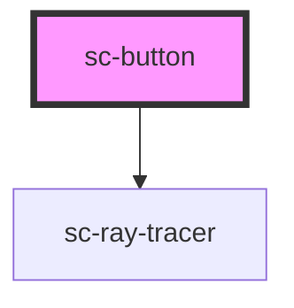

# sc-button


<!-- Auto Generated Below -->


## Usage

### Sc-button

<div class="intro">
A button is the most identifiable component for neumorphism designs. You can customise the use of a button in various ways. 
</div>

```html
<sc-button aria-label="Default button" onclick="alert('yo')">Button</sc-button>
```

You can use it the same way as an `<a>` tag.

```html
<!-- Anchor -->
<sc-button aria-label="Anchor tag" href="/" target="_blank" rel="noreferrer" title="button">
Anchor
</sc-button>
```

Add a `block` attribute to create a block level button.

```html
<!-- Block level -->
<sc-button aria-label="Block level button" block>Block Button</sc-button>
```

Use `icon` attribute to adjust styles to fit an icon into the button.

```html
<sc-button aria-label="Icon button" icon>
  <i class='bx bx-drink'></i>
</sc-button>
```

Use `icon-text` attribute to center align icon and text.

```html
<sc-button aria-label="Icon and text button" icon-text>
  <i class='bx bx-drink'></i>
  Text
</sc-button>

<sc-button aria-label="Icon and text button" icon-text>
  Text
  <i class='bx bx-drink'></i>
</sc-button>
```
Use `bordered` attribute to add a reflective border

```html
<sc-button aria-label="Icon button with a reflective border" bordered icon>
  <i class='bx bx-drink'></i>
</sc-button>
```

Use `circle` attribute to create a circle shaped button

```html
<sc-button aria-label="Circled button with image" circle>
  
</sc-button>
```

Use `flat` attribute to make button blend in with the surface (not a11y friendly)

```html
<sc-button aria-label="Flat button" flat>
  Flat button
</sc-button>
```

Use `disabled` attribute to disable the button like you're used to.

```html
<sc-button aria-label="Disabled button" disabled>
  Disabled button
</sc-button>
```


Combine attributes together to have a party

```html

<h6>Circle icon</h6>
<sc-button aria-label="Circle icon" icon circle>
  <i class='bx bx-drink'></i>
</sc-button>

<h6>Circle bordered</h6>
<sc-button aria-label="Circle bordered" circle bordered>
  
</sc-button>
```

You can add `ray-tracing` attribute to make it use the mouse as the light source, this could be used to draw more attention to the element.
```html
<sc-button ray-tracing>
  Look at me!
</sc-button>
```


## Properties

| Property     | Attribute     | Description                                                                                                                                                                                                                                                                               | Type                              | Default     |
| ------------ | ------------- | ----------------------------------------------------------------------------------------------------------------------------------------------------------------------------------------------------------------------------------------------------------------------------------------- | --------------------------------- | ----------- |
| `active`     | `active`      | Set active state for the button                                                                                                                                                                                                                                                           | `boolean`                         | `false`     |
| `block`      | `block`       | Make button `display: block`                                                                                                                                                                                                                                                              | `boolean`                         | `false`     |
| `bordered`   | `bordered`    | If prop exists, button will have an engraved-styled border                                                                                                                                                                                                                                | `boolean`                         | `false`     |
| `circle`     | `circle`      | Make button circle shaped                                                                                                                                                                                                                                                                 | `boolean`                         | `false`     |
| `disabled`   | `disabled`    | If `true`, the user cannot interact with the button.                                                                                                                                                                                                                                      | `boolean`                         | `false`     |
| `download`   | `download`    | This attribute instructs browsers to download a URL instead of navigating to it, so the user will be prompted to save it as a local file. If the attribute has a value, it is used as the pre-filled file name in the Save prompt (the user can still change the file name if they want). | `string`                          | `undefined` |
| `flat`       | `flat`        | Make button flat                                                                                                                                                                                                                                                                          | `boolean`                         | `false`     |
| `href`       | `href`        | Contains a URL or a URL fragment that the hyperlink points to. If this property is set, an anchor tag will be rendered.                                                                                                                                                                   | `string`                          | `undefined` |
| `icon`       | `icon`        | Icon only button                                                                                                                                                                                                                                                                          | `boolean`                         | `false`     |
| `iconText`   | `icon-text`   | If this button has both icon and text                                                                                                                                                                                                                                                     | `boolean`                         | `false`     |
| `rayTracing` | `ray-tracing` | Use mouse as the light source (ray-tracing)                                                                                                                                                                                                                                               | `boolean`                         | `false`     |
| `rel`        | `rel`         | Specifies the relationship of the target object to the link object. The value is a space-separated list of [link types](https://developer.mozilla.org/en-US/docs/Web/HTML/Link_types).                                                                                                    | `string`                          | `undefined` |
| `target`     | `target`      | Specifies where to display the linked URL. Only applies when an `href` is provided. Special keywords: `"_blank"`, `"_self"`, `"_parent"`, `"_top"`.                                                                                                                                       | `string`                          | `undefined` |
| `type`       | `type`        | The type of the button.                                                                                                                                                                                                                                                                   | `"button" \| "reset" \| "submit"` | `'button'`  |


## Events

| Event        | Description                          | Type                |
| ------------ | ------------------------------------ | ------------------- |
| `blurEvent`  | Emitted when the button loses focus. | `CustomEvent<void>` |
| `clickEvent` | Emitted when the button is clicked.  | `CustomEvent<void>` |
| `focusEvent` | Emitted when the button has focus.   | `CustomEvent<void>` |


## Slots

| Slot | Description                                                           |
| ---- | --------------------------------------------------------------------- |
|      | Content is placed between the named slots if provided without a slot. |


## CSS Custom Properties

| Name                                 | Description                                                            |
| ------------------------------------ | ---------------------------------------------------------------------- |
| `--sc-button-bg-color`               | Background of the button. - default: var(--sc-bg-color, #f6f6f8)       |
| `--sc-button-border-radius`          | Button border radius. - default: var(--sc-border-radius, 1em)          |
| `--sc-button-bordered-border-radius` | Bordered-style border radius - default: var(--sc-button-border-radius) |
| `--sc-button-bordered-border-width`  | Bordered-style border width - default: 2px                             |
| `--sc-button-circle-size`            | Circle button size. - default: calc(var(--sc-root-spacing, 8px) * 6)   |
| `--sc-button-edge-width`             | Width of the edge - default: 4px                                       |
| `--sc-button-icon-size`              | Icon button size. - default: calc(var(--sc-root-spacing, 8px) * 6)     |
| `--sc-button-padding-x`              | Horizontal paddings. - default: calc(var(--sc-root-spacing, 8px) * 4)  |
| `--sc-button-padding-y`              | Vertical paddings. - default: calc(var(--sc-root-spacing, 8px) * 2)    |
| `--sc-button-text-active-color`      | Text color with active prop - default: var(--sc-active-color, #c586c0) |
| `--sc-button-text-color`             | Button text color. - default: var(--sc-text-color, #333333)            |
| `--sc-button-text-hover-color`       | Text color on hover - default: var(--sc-secondary-color, #646695)      |
| `--sc-button-vertical-align`         | vertical align of the button - default: top                            |
| `--sc-button-width`                  | Set fixed width for button - default: auto                             |


## Dependencies

### Depends on

- [sc-ray-tracer](../sc-ray-tracer)

### Graph


----------------------------------------------

*Built with [StencilJS](https://stenciljs.com/)*
