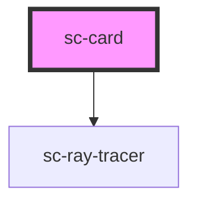

# sc-card


<!-- Auto Generated Below -->


## Usage

### Sc-card

<div class="intro">
  A card contains a set of relevant content on a single topic.
</div>

## Text based cards

Card's content can be added into the card via the default slot. `card-title` and `card-subtitle` properties are available to add styled card heading.

Add `engraved` to make the card appear to be sunk into the surface.

Add `bordered` to give the card a border that's reflective to the light source.

```html
<sc-card class="ma-4" card-title="Card" card-subtitle="I'm normal card">
  Lorem ipsum dolor, sit amet consectetur adipisicing elit. Atque natus autem veritatis architecto facilis
</sc-card>
<sc-card class="ma-4" engraved card-title="Card" card-subtitle="I'm engraved card">
  Lorem ipsum dolor sit amet consectetur adipisicing elit. Beatae quas dolorem voluptatibus facilis
</sc-card>
<sc-card class="ma-4" bordered card-title="Card" card-subtitle="I'm bordered card">
  Lorem ipsum dolor sit amet consectetur adipisicing elit. Voluptatum beatae velit maiores illum
</sc-card>
```

<h2>Media cards</h2>

`slot="media-content"` can be used inside the card element to show featured media.

```html
<sc-card class="ma-4" card-title="Top media" card-subtitle="5 Feb 2020" media-position="top">
  
  <div>
    Lorem ipsum dolor sit amet consectetur adipisicing elit. Perferendis rerum veniam natus sapiente porro
  </div>
</sc-card>
<sc-card class="ma-4" card-title="Bottom media" card-subtitle="5 Feb 2020" media-position="bottom">
  
  <div>
    Lorem ipsum dolor sit amet consectetur adipisicing elit. Perferendis rerum veniam natus sapiente porro
  </div>
</sc-card>
<sc-card class="ma-4" card-title="Left media" card-subtitle="5 Feb 2020" media-position="left">
  
  <div>
    Lorem ipsum dolor sit amet consectetur adipisicing elit. Perferendis rerum veniam natus sapiente porro
  </div>
</sc-card>
<sc-card class="ma-4" card-title="Right media" card-subtitle="5 Feb 2020" media-position="right">
  
  <div>
    Lorem ipsum dolor sit amet consectetur adipisicing elit. Perferendis rerum veniam natus sapiente porro
  </div>
</sc-card>
```


## Customise card title

Card heading section can be customised with the `custom-title` slot. 

```html
<sc-card class="ma-4">
  <div slot="custom-title">
    <div>
      <mark>Customise title with <code>slot="custom-title"</code></mark>
    </div>
    <div>
      <marquee>Go bananas inside the slot </marquee>
    </div>
  </div>
  Lorem ipsum, dolor sit amet consectetur adipisicing elit. Repellat, modi animi possimus fugiat accusamus vitae tempore suscipit asperiores eum cum nihil amet natus impedit iure
</sc-card>
```


## Ray tracing

You can add `ray-tracing` attribute to make it use the mouse as the light source, this could be used to draw more attention to the element.

Please note the ray-tracing feature modifies the CSS variables that's shared between components, if you have other components inside the cards that uses the highlight and shadow variables they will use the mouse as light source too. 

```html
<sc-card ray-tracing class="ma-4" card-title="Card" card-subtitle="I'm normal card">
  Lorem ipsum dolor, sit amet consectetur adipisicing elit. Atque natus autem veritatis architecto facilis
</sc-card>
<sc-card ray-tracing class="ma-4" engraved card-title="Card" card-subtitle="I'm engraved card">
  Lorem ipsum dolor sit amet consectetur adipisicing elit. Beatae quas dolorem voluptatibus facilis
</sc-card>
<sc-card ray-tracing class="ma-4" bordered card-title="Card" card-subtitle="I'm bordered card">
  Lorem ipsum dolor sit amet consectetur adipisicing elit. Voluptatum beatae velit maiores illum
</sc-card>
```


## Properties

| Property        | Attribute        | Description                                                      | Type                                                         | Default     |
| --------------- | ---------------- | ---------------------------------------------------------------- | ------------------------------------------------------------ | ----------- |
| `bordered`      | `bordered`       | If this card has bordered style                                  | `boolean`                                                    | `false`     |
| `cardSubtitle`  | `card-subtitle`  | Subtitle of the card                                             | `string`                                                     | `undefined` |
| `cardTitle`     | `card-title`     | Title of the card                                                | `string`                                                     | `undefined` |
| `engraved`      | `engraved`       | if true, card will appear engraved instead of raised by default. | `boolean`                                                    | `false`     |
| `mediaPosition` | `media-position` | Position of featured media in the card                           | `"bottom" \| "end" \| "left" \| "right" \| "start" \| "top"` | `null`      |
| `rayTracing`    | `ray-tracing`    | Use mouse as the light source (ray-tracing)                      | `boolean`                                                    | `false`     |


## CSS Custom Properties

| Name                              | Description                                                                                                             |
| --------------------------------- | ----------------------------------------------------------------------------------------------------------------------- |
| `--sc-card-bg-color`              | Background color of card.                                                                                               |
| `--sc-card-border-width`          | Border width for `bordered` card - default: 2px                                                                         |
| `--sc-card-bordered-width`        | Card border width (only applicable for bordered cards)                                                                  |
| `--sc-card-inner-padding-y`       | Padding between title section and content section                                                                       |
| `--sc-card-media-height`          | height of media part of the card                                                                                        |
| `--sc-card-media-object-position` | [object-position rule](https://developer.mozilla.org/en-US/docs/Web/CSS/object-position) for the media. default: center |
| `--sc-card-media-width`           | width of media part of the card                                                                                         |
| `--sc-card-outer-padding-x`       | Default: calc(var(--sc-root-spacing) * 4);                                                                              |
| `--sc-card-outer-padding-y`       | Default: calc(var(--sc-root-spacing) * 4);                                                                              |
| `--sc-card-subtitle-font-size`    | Subtitle font size                                                                                                      |
| `--sc-card-subtitle-font-weight`  | Subtitle font weight                                                                                                    |
| `--sc-card-subtitle-text-color`   | Subtitle text color                                                                                                     |
| `--sc-card-title-font-size`       | Title text font size.                                                                                                   |
| `--sc-card-title-font-weight`     | Title font weight                                                                                                       |
| `--sc-card-title-text-color`      | Title text color                                                                                                        |


## Dependencies

### Depends on

- [sc-ray-tracer](../sc-ray-tracer)

### Graph


----------------------------------------------

*Built with [StencilJS](https://stenciljs.com/)*
