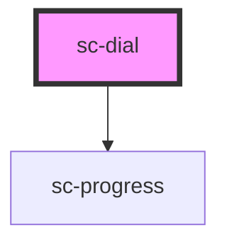

# sc-dial

<!-- Auto Generated Below -->

## Properties

| Property | Attribute | Description | Type     | Default |
| -------- | --------- | ----------- | -------- | ------- |
| `value`  | `value`   |             | `string` | `''`    |

## Events

| Event          | Description                             | Type                         |
| -------------- | --------------------------------------- | ---------------------------- |
| `blurEvent`    | Emitted when the input loses focus.     | `CustomEvent<void>`          |
| `changeEvent`  | Emitted when the value has changed.     | `CustomEvent<any>`           |
| `focusEvent`   | Emitted when the input has focus.       | `CustomEvent<void>`          |
| `inputEvent`   | Emitted when a keyboard input occurred. | `CustomEvent<KeyboardEvent>` |
| `keyDownEvent` | Emitted when a key is pressed down      | `CustomEvent<void>`          |

## Shadow Parts

| Part        | Description |
| ----------- | ----------- |
| `"rotator"` |             |

## Dependencies

### Depends on

- [sc-progress](../sc-progress)

### Graph

----------------------------------------------

*Built with [StencilJS](https://stenciljs.com/)*
