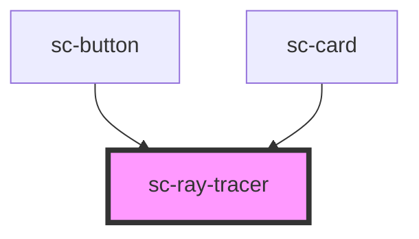

# sc-ray-tracer

<!-- Auto Generated Below -->

## Properties

| Property  | Attribute | Description | Type          | Default |
| --------- | --------- | ----------- | ------------- | ------- |
| `element` | --        |             | `HTMLElement` | `null`  |

## Methods

### `setElement(target: HTMLElement) => Promise<void>`

#### Returns

Type: `Promise<void>`

## Dependencies

### Used by

 - [sc-button](../sc-button)
 - [sc-card](../sc-card)

### Graph

----------------------------------------------

*Built with [StencilJS](https://stenciljs.com/)*
