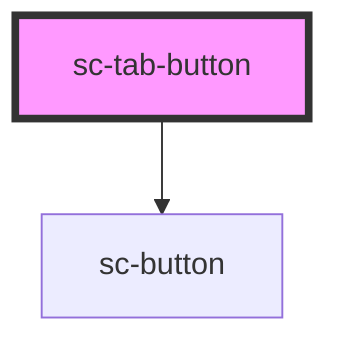

# sc-tab-button

<!-- Auto Generated Below -->

## Properties

| Property   | Attribute  | Description                                                                                       | Type      | Default     |
| ---------- | ---------- | ------------------------------------------------------------------------------------------------- | --------- | ----------- |
| `active`   | `active`   | When prop is set, this tab is shown, only one `<sc-tab>` element can be active inside `<sc-tabs>` | `boolean` | `false`     |
| `block`    | `block`    | The button shape.                                                                                 | `boolean` | `false`     |
| `bordered` | `bordered` | If prop exists, button will have an engraved-styled border                                        | `boolean` | `false`     |
| `icon`     | `icon`     | Icon only button                                                                                  | `boolean` | `false`     |
| `target`   | `target`   | id of the target `sc-tab-content` tag                                                             | `string`  | `undefined` |

## Events

| Event           | Description | Type                       |
| --------------- | ----------- | -------------------------- |
| `activeEvent`   |             | `CustomEvent<HTMLElement>` |
| `inactiveEvent` |             | `CustomEvent<HTMLElement>` |

## Methods

### `setActive(emitEvent?: boolean) => Promise<void>`

#### Returns

Type: `Promise<void>`

### `setInactive(emitEvent?: boolean) => Promise<void>`

#### Returns

Type: `Promise<void>`

## Dependencies

### Depends on

- [sc-button](../../sc-button)

### Graph

----------------------------------------------

*Built with [StencilJS](https://stenciljs.com/)*
